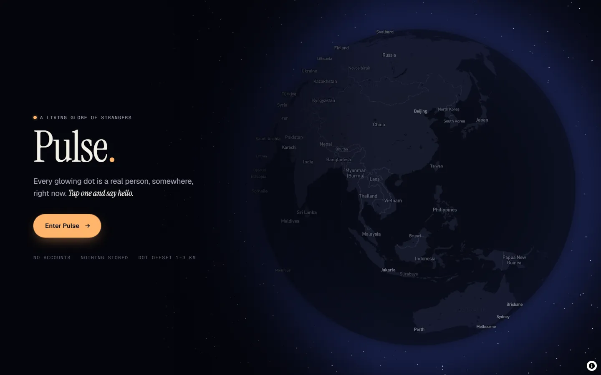

# NOTES

## Phase 1 — Make it run

Full log with root causes and file references: [`docs/phase-1.md`](docs/phase-1.md).

**How I found them:**
- Read the whole lifecycle end to end (join → heartbeat → reaper → request/accept →
  SDP/ICE → data channel → video → end/leave).
- Compared each handler's code with its own comments and `docs/requirements.md`.
- For every state flag, asked "who clears this, and when?"
- Verified with two browsers: a manual playwright-cli run of two sessions on the real
  Neon + Mapbox stack, plus an automated two-context Playwright test (`npm run e2e`).
  The manual run found B6, which the first automated run had missed.

**What was broken → fix (one commit each):**
- **Dots never disappeared:** the poll heartbeat ran `updateMany({ where: {} })`,
  refreshing *everyone* on every poll, so the stale reaper never fired.
  → Heartbeat only the caller.
- **Chat never arrived:** the sender tagged messages `"msg"` but the receiver
  only accepted `"chat"`. → Use one tag.
- **Connections/video could fail to establish:** queued ICE candidates were
  flushed *before* `setRemoteDescription`, so they all threw (silently caught)
  and were lost. → Apply the remote description first, then flush.
- **Users stuck "busy" after one call:** `busy` was cleared on `decline` but not
  on `end`. → Clear on both. Pairing is now tracked in a `Presence.peerId`
  column, and only the actual pair is freed, so a stray decline can't free
  someone who is in another call.
- **Map broke silently without a token:** a fake fallback Mapbox token hid the
  "set your token" hint. → Removed it.
- **Couldn't end a video call on a laptop screen:** the remote video's intrinsic
  height pushed "End video" off-screen in a page that can't scroll. → `min-h-0`
  and an absolutely positioned video. The e2e test now asserts the control is in
  the viewport.

**Reliability fixes needed for "reliably connect":**
- **Leaving mid-chat stranded the partner:** leave and the stale reaper now free
  the partner and send them `end`. Leave no longer deletes the leaver's unsent
  `end`. The client also tears down as soon as the data channel closes.
- **A late accept after a timeout locked both users:** the requester now replies
  `end` to an accept it isn't waiting for.
- **A reaped user (throttled background tab, bfcache restore) was invisible for
  good:** poll returns `410 Gone`, and the client re-joins.

**Known, deferred:**
- Signals aren't sequenced, so offer/ICE can race. Perfect negotiation recovers
  in practice.
- ~~Join failures aren't surfaced in the UI.~~ Fixed in Phase 2: the entry gate
  shows the error and a retry.
- No authentication on session ids. This is Phase 3.

**Schema change:** run `npx prisma migrate deploy` (or `db push`) to add
`Presence.peerId`. The Prisma CLI uses `DATABASE_URL_UNPOOLED` (the direct
connection) when it's set; the app uses the pooled `DATABASE_URL`.

## Phase 2 — Make it good

Full write-up with screenshots: [`docs/phase-2.md`](docs/phase-2.md).

**Direction: "Nightfall".** Pulse is "a living globe of strangers", so the planet
is the hero. It's a 3D globe in starry space, the UI is frosted glass floating
over it, and the dots glow like bioluminescence.

**Design system:**
- **One colour rule:** warm ember means *you* (your beacon, your bubbles, your end
  of the arc, primary actions). Strangers get cool hues from their session id,
  and each keeps that colour everywhere: dot, orb, arc, chat tint.
- **Type:** Instrument Serif for personality, Geist for UI, Geist Mono for
  numbers. Fixed an `Arial` override that was hiding Geist.
- Tokens and a `glass` utility live in `globals.css` (`@theme`).

**What changed, and why:**
- **Map:** globe projection, atmosphere and stars, with `dark-v11` recoloured and
  decluttered. I chose this over Mapbox Standard/night: its 3D detail is
  invisible at Pulse's zooms and it renders slower.
- **Entry:** the gate floats over the live, spinning globe (opening on your side
  of the world), then flies you down to your beacon. Locating has its own state,
  and each error has specific copy and a retry.
- **Requests** say who and where: the stranger's orb, a coarse distance and
  direction, and a ring that drains over the real 30 s timeout. The incoming
  card is non-modal and sits at thumb height on phones.
- **The arc:** a great-circle line from you to the stranger, with a comet that
  searches, flies home when someone calls you, or pulses once connected. The
  map tells the same story as the panels.
- **Chat:** a glass card on desktop (globe still visible) or a bottom sheet on
  phones. Grouped, animated bubbles; connecting and empty states. Video
  negotiation is inline in the chat, and its accept card has no autofocus, so
  Enter mid-sentence can't turn on your camera.
- **Call:**
  - Layout: on desktop the stage sits beside the chat, so you can keep texting.
  - Controls: mute, camera off and a timer. Mute and camera state reach the other
    side over the data channel, so they see "Muted" or "Their camera is off"
    instead of a black frame.
  - The self-view is draggable and snaps to a corner.
- **Attention:** a background tab flashes its title and plays a soft synthesised
  chime when a request arrives.
- **HUD and notices:** live count, recenter, first-run hint, and one deduped
  `aria-live` toast stack.
- **Accessibility:**
  - Reduced motion is respected everywhere (spin, comet, CSS and motion
    transforms). The request countdown keeps running because it carries
    information.
  - Esc backs out of pending requests but never hangs up.
  - Focus rings; 44px touch targets; alertdialog semantics on request cards.

**Bugs found along the way:**
- **Dots jumped on hover.** The hover `transform` overwrote Mapbox's positioning
  transform, and Mapbox also writes marker `opacity` on the globe. Styling now
  lives on child elements and `data-*` attributes.
- **The glass panels had no blur.** The CSS minifier kept only
  `-webkit-backdrop-filter`, which Chrome ignores.
- **A dropped call blamed "the network".** It now says the connection to the
  stranger was lost. The e2e asserts that the chat closes, instead of racing two
  toasts.

**Constraints I kept:**
- No server API changes.
- The conn/video state machine is untouched; new UI state is derived during
  render.
- Distance is computed in the browser from your location to their dot, which is
  already public and offset 1–3 km. Nothing new leaves the browser.

**Verification:** lint, `tsc`, `next build` and `npm run e2e` all pass. The e2e
now also checks the request distance and the mute round trip. I also did manual
two-browser runs at 1440×900 and 390×844.

**Deferred:**
- Delivery latency for requests in long-hidden (throttled) tabs.
- A fade-out when a dot leaves.
- A cheaper glass fallback for low-end phones.
