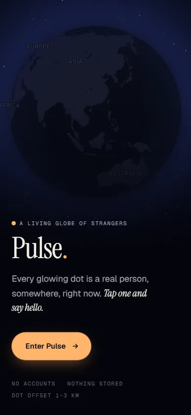
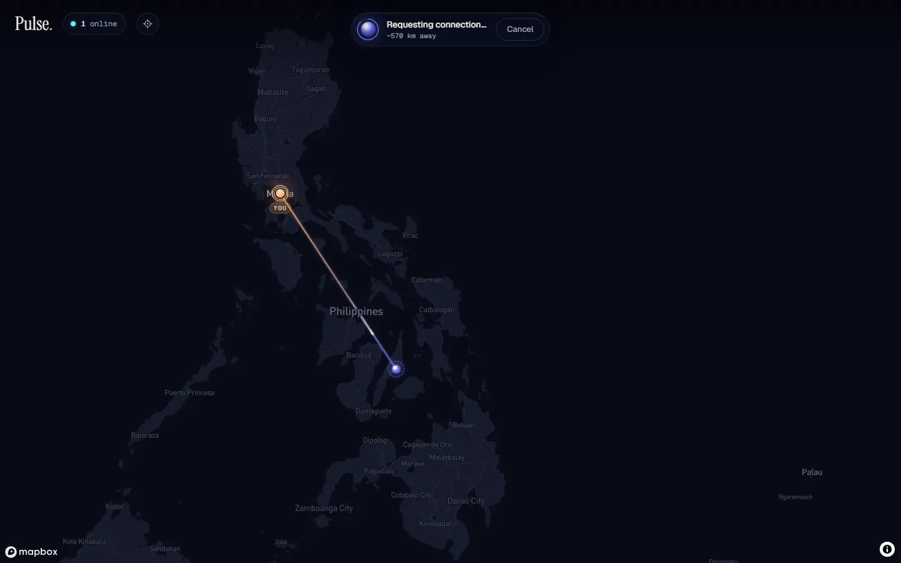
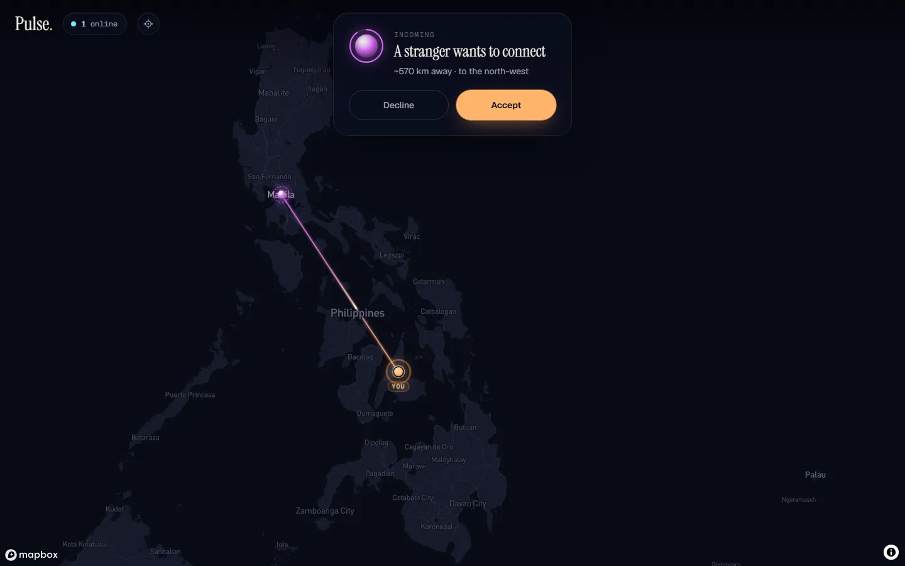
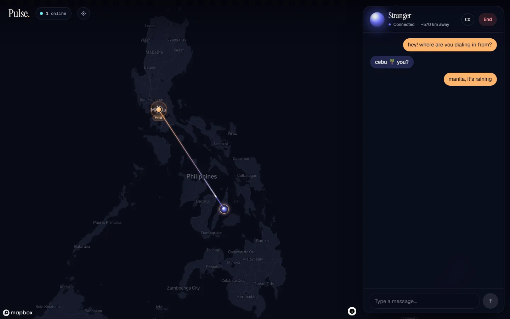
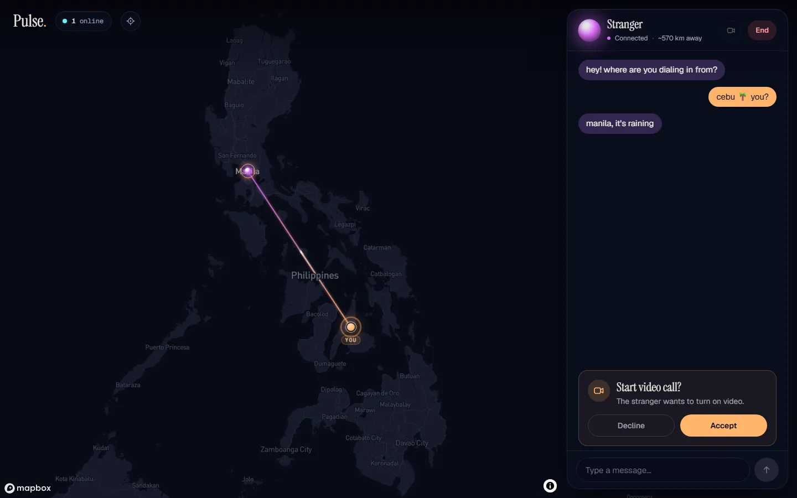
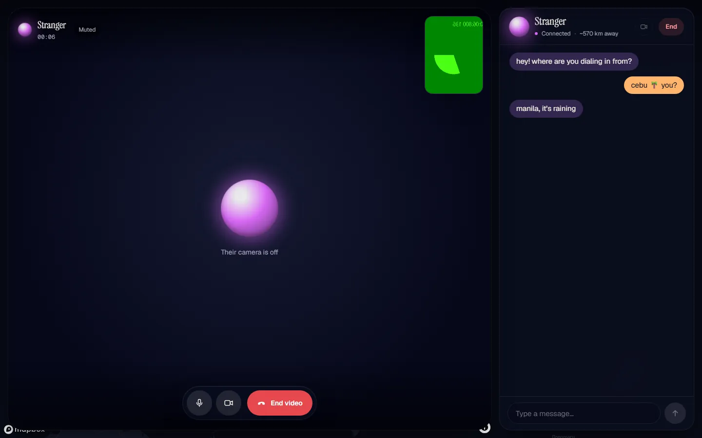
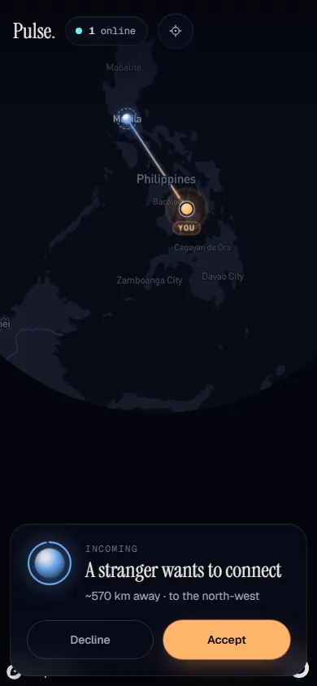
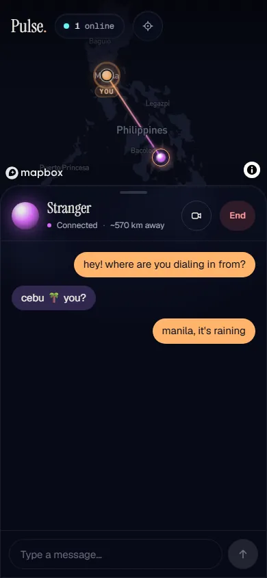
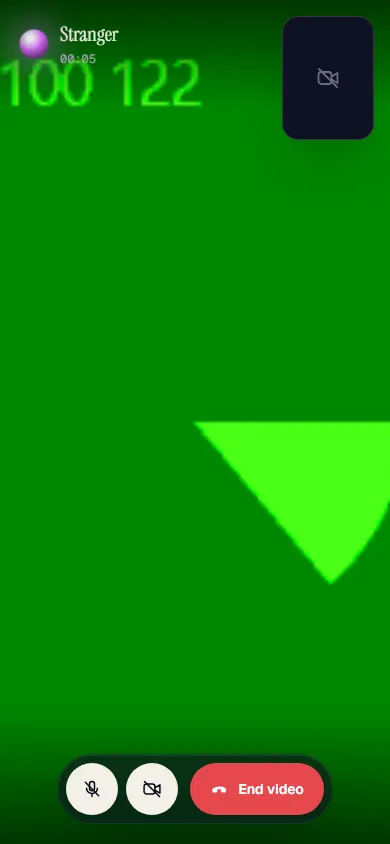

# Phase 2 — Make it good

## The idea: "Nightfall"

Pulse is pitched as *a living globe of anonymous strangers*, so the planet is the
hero and everything else is frosted glass floating over it. The old app was a
flat mercator map with stock zinc/emerald panels; it worked, but nothing about it
said *there are real people out there, right now*.

| Desktop | Phone |
|---|---|
|  |  |

## Design system

- **One colour rule, used everywhere: warm means you, cool means them.**
  - *Ember* (`#ffb46b`) is the only warm colour. It marks your beacon, your chat
    bubbles, your end of the arc, and primary actions.
  - Strangers get a hue from the cool band (teal → violet), derived from their
    ephemeral session id. One stranger keeps one colour everywhere: their dot,
    the orb on request cards and in chat, the far end of the arc, and the tint of
    their bubbles. Across panels and map, you always know who is who.
- **Type.**
  - *Instrument Serif* for personality: the wordmark, and moments like "A
    stranger wants to connect" or "Say hello."
  - Geist for UI text, Geist Mono for labels and numbers (distance, timer,
    online count).
  - Fixed a scaffold bug where `body { font-family: Arial }` silently overrode
    Geist.
- **Tokens** live in `app/globals.css` under `@theme`: space/night neutrals,
  ink, ember, glass, radii, shadows, an expo ease and the display/title/label
  type steps. Plus one `glass` utility for every panel.

## The map

- **Globe + atmosphere + stars** (`projection: "globe"`, `setFog`), with
  `dark-v11` recoloured at runtime into ink-blue land on a near-black ocean.
  Street-level clutter (roads, POIs, transit labels) is hidden; places stay as
  quiet context. See `app/components/map/nightfall.ts`.
  - **Why not Mapbox Standard with the night preset:** its 3D detail is
    invisible at the zoom levels Pulse lives at (1–5). It renders slower, which
    matters in the e2e run on software WebGL. And it gives less direct control
    over the palette.
- **Dots** glow and breathe out of phase (a per-id animation delay), so the globe
  feels alive instead of blinking in lockstep. Hover or focus shows a tooltip
  with the dot's state: "Tap to connect", "In a conversation", "Finish your chat
  first". Busy dots fade and can't be tapped.
- **Your beacon** replaces the 📍 emoji: an ember core with sonar rings and a
  small "YOU" tag.
- **The arc** (`app/components/map/arc.ts`): while you're linked with someone, a
  great-circle line joins you (ember) to them (their hue). A comet of light runs
  along it:
  - searching, while your request is out;
  - flying toward you, while someone is calling you;
  - a slow heartbeat, once you're connected.

  The camera frames you both in the space the panels leave free. This ties the
  map to the panels: the conversation you're having is drawn on the planet.

| Requesting | Incoming |
|---|---|
|  |  |

## The flow

1. **Entry.** The gate is an overlay on the real, slowly spinning globe instead
   of a blank page.
   - It opens on your side of the world, guessed from your timezone, before
     you've granted anything.
   - On Enter, the camera flies down to your beacon.
   - "Finding you…" shows radar rings.
   - Each failure has specific copy and a retry: permission denied (with how to
     fix it), timeout, unsupported browser, server unreachable. `join()` now
     throws on a failed response, so you can no longer enter an invisible
     session.
2. **HUD.** Wordmark, a live online count ("Just you, for now" when empty) and
   *Recenter on me*. A first-run hint says "Tap a glowing dot to say hello"; an
   empty globe says your dot is live rather than looking broken.
3. **Requests** say who and where:
   - the stranger's orb;
   - a coarse distance and compass direction (e.g. "~570 km away · to the
     north-west");
   - a ring that drains over the real 30 s request timeout.

   Outgoing requests are a compact pill with Cancel. Incoming requests are a
   non-modal card: top-centre on desktop, docked at thumb height on phones.
4. **Chat.**
   - Layout: a glass card docked right on desktop, so the globe stays visible; a
     68dvh bottom sheet on phones.
   - Messages: bubbles animate in and group consecutive messages.
   - States: a shimmer while the peer-to-peer channel opens, and an empty state
     that explains the privacy model.
   - Video negotiation moved *into* the chat: an inline "waiting" line, and an
     inline accept card that deliberately has no autofocus, so pressing Enter
     mid-sentence can't turn your camera on.
5. **Call.**
   - Layout: on desktop, a rounded stage beside the chat, so you can keep
     texting during the call; on phones, full screen.
   - Before their video arrives, their orb with sonar rings replaces the black
     rectangle.
   - Controls: mute and camera-off (`track.enabled`, so no renegotiation),
     announced to the other side over the data channel. They see "Muted" and
     "Their camera is off" instead of a frozen-looking black frame.
   - Extras: an mm:ss timer, and a mirrored self-view you can drag that glides to
     the nearest corner.
6. **Attention.** If a request arrives while the tab is in the background, the
   tab title flashes and a soft two-note WebAudio chime plays. Audio is unlocked
   by the Enter click, and both stop the moment you look.
7. **Notices** are one deduplicated `aria-live` toast stack. A dropped call now
   says "Lost the connection to the stranger." instead of blaming "the network".

| Chat | Video prompt | Call |
|---|---|---|
|  |  |  |

| Phone: incoming | Phone: chat sheet | Phone: call |
|---|---|---|
|  |  |  |

*(Call screenshots use Chrome's synthetic camera feed.)*

## Accessibility

- `prefers-reduced-motion`:
  - These stop: the globe spin, the arc comet, ambient CSS motion (halos, sonar,
    radar, breathing orbs, shimmer) and motion transforms (`MotionConfig
    reducedMotion="user"`). Mapbox's own camera moves become jumps.
  - The request countdown keeps running, because it carries information.
- **Esc** cancels your request or declines theirs (connection or video). It never
  hangs up a conversation you're in.
- Focus:
  - Accept is autofocused for connection requests only.
  - When a chat closes, focus returns to the map.
  - Every control has a visible ember focus ring.
- Touch targets: 44px on coarse pointers, including an invisible hit area around
  the 12px dots.
- Request cards are `alertdialog`s with labels. Mute and camera are
  `aria-pressed` toggles with fixed labels.

## Engineering notes

- **Mapbox owns the marker element's `transform` (position) and, on the globe,
  its `opacity`** (fading dots past the horizon).
  - The old `.pulse-dot:hover { transform: scale(1.3) }` overwrote the
    positioning transform, so dots jumped off their coordinate on hover.
  - Every visual state now lives on child elements and `data-*` attributes.
  - The e2e test waits on `data-busy`, not opacity.
- **The glass had no blur.** Writing `backdrop-filter` next to its `-webkit-`
  twin made Lightning CSS keep *only* the prefixed form, which Chrome ignores.
  The `glass` utility now builds it from Tailwind's backdrop utilities, which
  emit both.
- **The globe's size can't be computed from zoom.** Mapbox enlarges the globe at
  low zooms, so the entry framing measures the projected radius and corrects the
  zoom until the globe fits the free space.
- **No changes to the conn/video state machine or the server API.**
  - Everything new is derived during render: the linked stranger, their
    colour, their distance.
  - The only protocol addition is peer-to-peer: `mic-on/off` and `cam-on/off`
    data-channel controls. Unknown control strings are now dropped instead of
    cast.
- **Distance is computed in the browser** from your real location to their dot,
  which is already public and already offset 1–3 km. It's deliberately coarse:
  "Nearby" under 15 km, rounded above that. Nothing new leaves the browser.
- **e2e timing fix.** A killed tab can't say goodbye, so its partner learns of
  it from the stale reaper (~15 s) or from ICE failing (~17 s), whichever comes
  first. The heavier globe page shifted that race. The test now asserts the
  outcome (the partner's chat closes), not one specific toast.

## Verification

- `npm run lint`, `npx tsc --noEmit` and `npm run build` are clean.
- `npm run e2e` passes. The two-browser flow now also checks the request
  distance and the mute round trip.
- Manual two-browser runs with Playwright at 1440×900 and 390×844, using the
  screenshots above. Separate probes checked:
  - the title flash and chime on a hidden tab;
  - that the spin stops under reduced motion;
  - the mic/camera data-channel messages arriving on the other side.

## Known gaps / next

- Background tabs throttle timers, so a request can arrive late in a long-hidden
  tab. The chime helps once it lands, but delivery latency is a Phase 4
  candidate (e.g. a Web Push or SSE upgrade).
- During a call the stage covers the map, including the Mapbox logo. While the
  call is open the map isn't visible at all, so I accepted this. Outside calls,
  the logo and attribution slide clear of the chat card and sheet.
- Glass blur costs GPU time on low-end phones over a constantly repainting map.
  A next step would be a cheaper `glass-strong` fallback under
  `prefers-reduced-transparency`.
- Dots appear with an animation but disappear instantly. A fade-out needs
  delayed marker removal.
