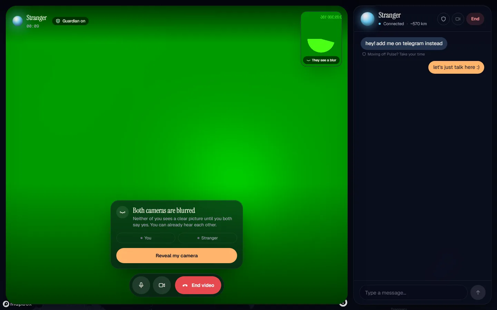
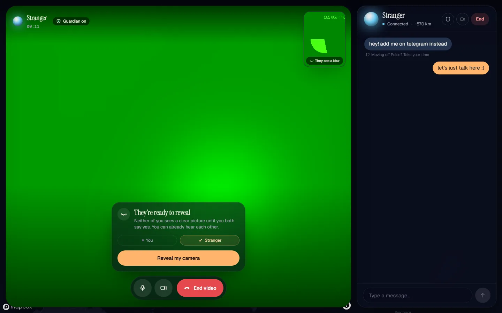
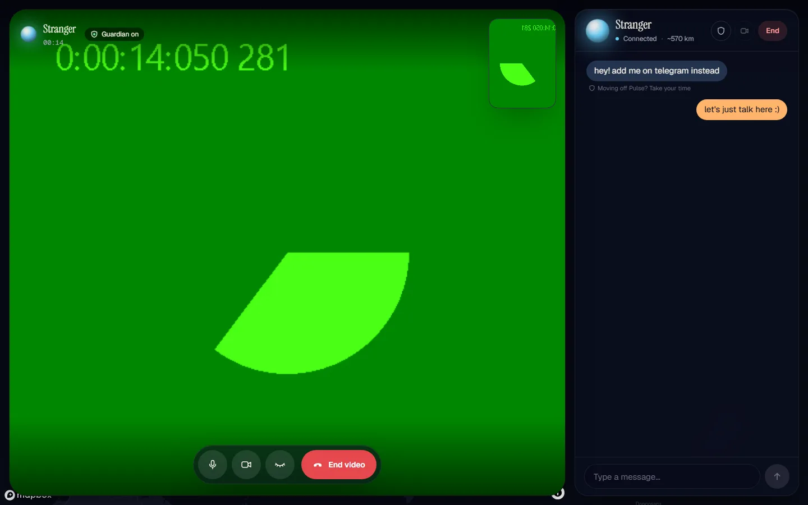
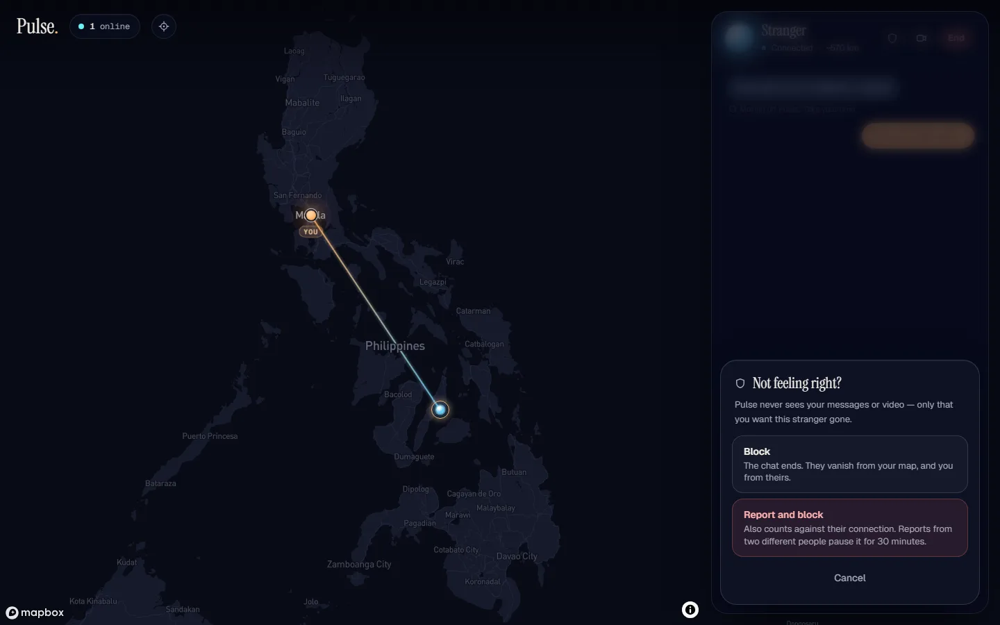
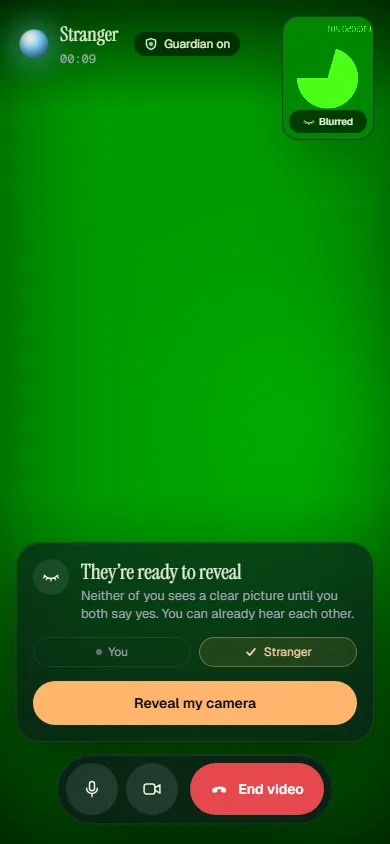
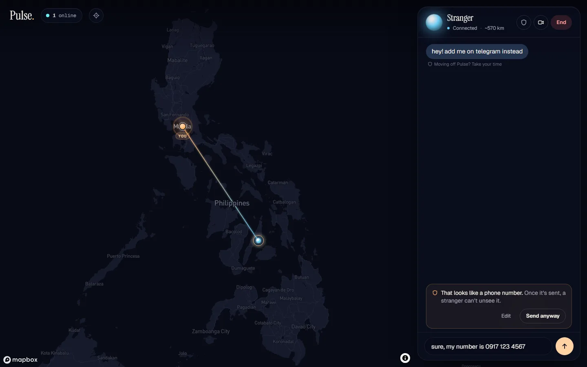
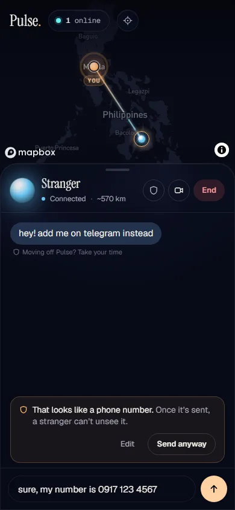

# Phase 4 — Make it better: Safe Reveal

## The idea

Pulse connects you with a random stranger, and the riskiest moment is the
first frame of video. Before this change, the stranger's camera filled your
screen from the start, and so did yours on theirs. Whatever they pointed it
at, you saw before you could react. Your only tool was the End button, and by
then you'd seen it.

**Safe Reveal makes the first moment consensual.** It does this without adding
any surveillance: every check runs on your device or is agreed peer to peer,
and the server never sees chat or video. It has four parts:

1. **Veil:** cameras start blurred *at the source* and clear only when both
   people say yes.
2. **Guardian:** after reveal, an on-device classifier blurs the stranger's
   video again if it turns explicit.
3. **Block and report:** they work without accounts, and reports have real
   consequences that one person can't abuse.
4. **Chat guard:** a nudge before you share something that identifies you, and
   a note on the usual opening moves of a scam.

| | |
|---|---|
|  |  |
| Video starts veiled. You see a wash of colour, not a person. | The stranger said yes. Your camera stays blurred until you do. |
|  |  |
| Both said yes. The Guardian is on, and either side can veil again. | Block or report, with plain words about what each does. |

## 1. Veil: blurred before it leaves your device

- **What the stranger receives** (`lib/veil.ts`):
  - Your raw camera plays into a hidden `<video>`.
  - Each frame is drawn into a **12 px-wide canvas**, then scaled up to 160 px
    with smoothing.
  - The stranger gets that canvas's `captureStream()`, so no face, text or
    body detail exists in the stream at all.
  - This is the key property. Blurring on the receiver's side would protect
    the receiver, but a modified client could just remove the blur. A veil
    applied at the source protects **you**, whatever client the stranger runs.
- **Swapping to the real camera** (`PeerSession.setRevealed`, `lib/webrtc.ts`):
  - It calls `RTCRtpSender.replaceTrack`, so the swap needs no renegotiation
    and is instant in both directions.
- **Consent** travels over the existing data channel as two controls:
  - `reveal` means "I'm ready".
  - `veil` means "back under, both of us".
  - Each side unveils its own camera only when it has sent *and* received a
    `reveal`. Either person can veil both cameras again at any time.
  - Ending the video or the call resets everything.
- **Defence in depth:** the receiver also CSS-blurs the incoming video until
  reveal. A modified sender that skips the veil still shows you nothing clear.
- **UI** (`VideoPanel.tsx`):
  - A consent card shows "You / Stranger", each with a tick once they've said
    yes.
  - The self-view is labelled "They see a blur", so you know what you're
    sharing.
  - A veil button joins the call controls once revealed.
  - Audio flows before reveal, and the card says so: talking first is a large
    part of what makes revealing feel safe.

## 2. Guardian: on-device nudity check

- **What it does** (`lib/guardian.ts`, `app/hooks/useGuardian.ts`):
  - Once revealed, it samples the stranger's video about **once a second** with
    nsfwjs MobileNetV2 on TensorFlow.js.
  - **Two consecutive frames** scoring Porn + Hentai ≥ 0.6 blur the stage
    locally, and a card asks: Keep it blurred (veils both again) / Show anyway
    (trusts them for the rest of this call) / Report and leave.
  - A single odd frame doesn't trigger it. Swimwear ("Sexy") alone doesn't
    either: I only count the explicit classes.
- **Private by construction:** no frame, score or verdict leaves the browser,
  and the stranger isn't told.
- **Cheap when idle:**
  - TF.js and the model load **lazily** when a call starts, never on the map.
  - The model is self-hosted at `public/models/nsfw/`: 2.6 MB, extracted from
    the npm package by `scripts/extract-nsfw-model.mjs`. That makes it about
    25 % smaller than the bundled base64 version, cacheable, and served under
    the existing `'self'` CSP.
  - It uses the WebGL backend, falling back to CPU. There's no WASM, so the CSP
    doesn't need `'wasm-unsafe-eval'`.
  - It skips sampling while the tab is hidden.
- **Fails open, visibly:**
  - If the model can't load (no WebGL, blocked download), the chip says
    "Guardian off", and its tooltip explains why.
  - The call continues because the veil and consent still apply. Breaking
    calls on older devices would be worse.

## 3. Block and report, without accounts

Phase 3 deferred this. The hard part is making a report *mean* something when
anyone can open a new tab and become a new stranger, without fingerprinting
people.

- **Block** (`POST /api/report { toId }`):
  - It's between two sessions: neither sees the other's dot again, and requests
    between them are auto-declined.
  - An auto-decline looks exactly like a busy stranger, so a block can't be
    probed for.
  - If you're in a call, it ends. If they're asking to connect, it's declined.
  - **The stranger is never told.** They see someone who hung up or said no.
- **Report** (`{ toId, report: true }`) also blocks, and counts against the
  reported stranger's **network** (the hashed IP already used for rate
  limits). Reports from **2 different networks within 30 minutes pause that
  network**:
  - its session is removed immediately (its poll gets 410)
  - joins return 403 `paused` until the window passes
  - the client goes back to the gate with a calm, specific explanation and the
    minutes remaining
- **Why one person can't abuse it:**
  - You can only report someone you **actually talked to**. The server checks
    `peerId`/`lastPeerId`; it doesn't trust the client.
  - A network counts **once** per target (`@@id([targetIp, reporterIp])`).
    Opening ten tabs is still one vote.
  - A report from the target's **own** network never counts, so two tabs
    behind one router can't pause each other.
- **Reporting someone who fled:** at pairing time each side records its peer's
  hashed IP (`lastPeerIp`). Someone who flashes you and instantly closes the
  tab can still be reported. Without this, reports would miss exactly the
  people who most deserve one.
- **Nothing outlives its purpose** (`lib/safety.ts` `sweepSafety`, run by the
  reaper):
  - blocks go when either session goes
  - reports go when their 30-minute window closes
- **Schema** (additive, `npx prisma db push`):
  - `Presence.ipKey/lastPeerId/lastPeerIp`
  - `Block`
  - `Report`

## 4. Chat guard

| | |
|---|---|
|  |  |

- **Outgoing** (`lib/chatGuard.ts` `detectSensitive`): a message that looks
  like a phone number, email, social handle, link or street address gets one
  inline prompt: "a stranger can't unsee it", with **Edit / Send anyway**.
  Pressing Enter again also sends.
- **Incoming** (`cautionFor`): links, "add me on WhatsApp" and money talk (gift
  cards, crypto, "send money") get a quiet caption under the bubble.
- **Conservative on purpose.** A prompt that fires on every other message
  trains people to click through it. The pure tests pin both what is flagged
  and what isn't ("2019-2023", "a 2 hour road trip", "my insta is great for
  food pics").
- Incoming text is now capped at 1000 characters. The input already capped
  what you send, but a modified client could send more.

## Trade-offs I chose

- **The Guardian fails open.** A missing safety net is shown in the UI, but it
  doesn't end the call. The veil is the primary protection; the Guardian is
  the second line.
- **Classifier accuracy:** nsfwjs is roughly 90 % accurate. False positives
  cost one tap (Show anyway); false negatives fall back to End and Report.
- **Pausing a network can hit bystanders behind carrier-grade NAT.** It's
  bounded: 2 distinct networks are needed, each must have actually talked to
  the target, and the pause lasts 30 minutes. That's the price of
  consequences without accounts or fingerprinting.
- **Hashed IPs are unsalted SHA-256** (as in Phase 3), so an IPv4 hash can be
  brute-forced. They're kept only for the session or report window.
- **Background tabs** throttle the veil's draw timer to about 1 fps. That only
  affects the blurred stream, and only while you aren't looking.
- **Blocks last a session.** A blocked stranger who reloads becomes a new dot.
  Reports, not blocks, are what follow a network.

## Verification

- `npm run e2e` runs 22 tests against the dev server and the production build
  (`E2E_SERVER=start`, real CSP, no `'unsafe-eval'`):
  - **`two-users.spec.ts`:**
    - Video arrives ≤ 160 px wide until both reveal, then at full size.
    - Either side can veil both cameras again.
    - The Guardian model loads and runs.
    - The whole flow raises no CSP violations.
    - A second test covers the chat guard prompt, the incoming caution, and
      blocking from the chat. Both maps empty, and the stranger only sees a
      hang-up.
  - **`safety.spec.ts`** (API):
    - You can only block or report your own stranger.
    - A block hides both dots and auto-declines requests.
    - Reports dedupe by network and ignore the target's own network.
    - Two networks pause the target: poll returns 410, and join returns 403
      with roughly 30 minutes to wait.
  - **`safety-pure.spec.ts`:** the chat guard's true and false positives, and
    the Guardian's two-frame rule.
- Lint, `tsc --noEmit` and `next build` are clean.
- Manual run with two production-build browsers at 1440×900 and 390×844 (the
  screenshots above). It found three layout bugs, fixed in `492d643`:
  - the Guardian chip hidden under the self-view
  - a truncated distance in the chat header
  - a wrapping badge on phones
- **Testing locally:** two windows on one machine share an IP, so they can't
  pause each other. That's the own-network rule working. `safety.spec.ts` uses
  distinct `x-real-ip` values to exercise the pause.
- One flaky run (once in about seven two-browser runs): a handshake stuck on "Connecting…" on a cold
  dev server, while the API routes were still compiling. It didn't reproduce
  on reruns or on the production build. Signals aren't sequenced (Phase 1,
  deferred).

## Next, with more time

- **A Guardian check of your own camera before you reveal** ("you're about to
  show more than you might think"). It would protect people from their own
  accidents, not just from strangers.
- **Run the Guardian in a Worker** with `OffscreenCanvas`, keeping inference
  off the main thread on low-end phones.
- **Escalating pauses** for networks that are paused repeatedly, and a
  short-lived signed "good standing" token, so a reported network's innocent
  neighbours recover faster.
- **On-device text toxicity** (a small model) to soften slurs in incoming chat
  before you read them.
- **TURN** (still), so peers stop seeing each other's IP address.
